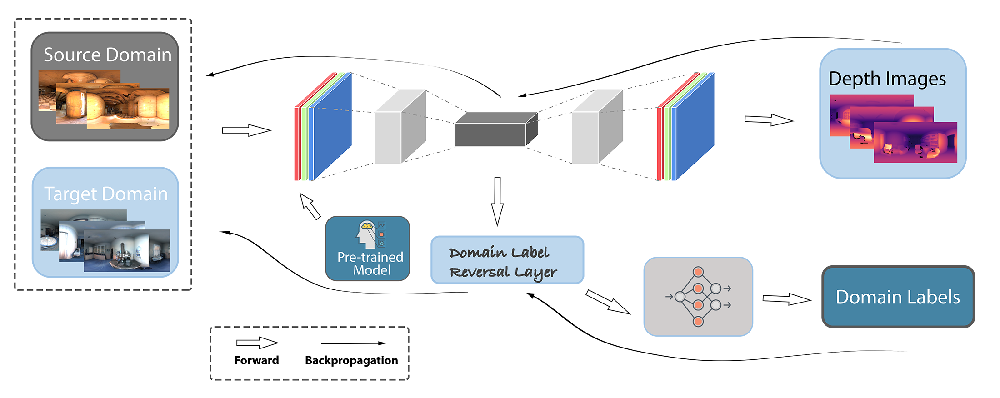

# Depth Estimation from a Single Omnidirectional Image using Domain Adaptation




## Install

Check https://pytorch.org/ and choose a suitable version of PyTorch for your computers/servers

```
pip install opencv-contrib-python
```

## Dataset
Download the 3D60 depth dataset from https://vcl3d.github.io/3D60/ 
```
@inproceedings{zioulis2018omnidepth,
	title={Omnidepth: Dense depth estimation for indoors spherical panoramas},
	author={Zioulis, Nikolaos and Karakottas, Antonis and Zarpalas, Dimitrios and Daras, Petros},
	booktitle={Proceedings of the European Conference on Computer Vision (ECCV)},
	pages={448--465},
	year={2018}
}
```


## Train
### complete the argumentparser (fill with absolute path)

parser.add_argument('--tm', default='', type=str, help='trained-model saving path')

parser.add_argument('--pkl', default='', type=str, help='pkl results saving path')

parser.add_argument('--train1', default='', type=str, help='source domain training dataset')

parser.add_argument('--tdcsv', default='', type=str, help='target domain testing dataset')


### start training 
```
python train_domain_adaptation.py --bs 16 --epochs 100 --comments your_comments
```

## Notice

The encoder-decoder framework is based on 

```
@article{alhashim2018high,
	title={High quality monocular depth estimation via transfer learning},
	author={Alhashim, Ibraheem and Wonka, Peter},
	journal={arXiv preprint arXiv:1812.11941},
	year={2018}
}
```
